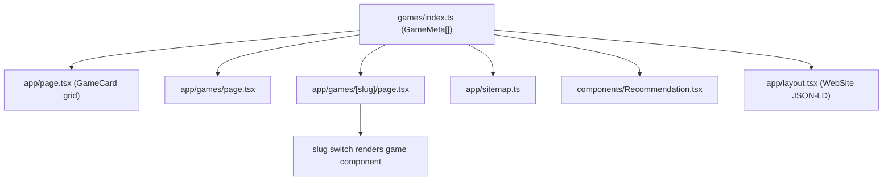

# Architecture

Card Station is a Next.js 16 App Router app that serves a small set of card games.
There is no server-side game state or database — every game runs entirely client-side and persists
its own progress in `localStorage`. The only server route is a contact form that relays email.

The UI is mobile-first and responsive: it must work well on phones as well as desktop. Layout uses
Tailwind's mobile-first breakpoints (base styles target mobile; `sm:` and up target larger screens),
and games adapt to viewport size where needed.

## Render flow

```
app/layout.tsx  (root layout)
  ├─ global <Metadata>, WebSite JSON-LD, ambient neon background
  ├─ Header / Footer
  ├─ Vercel Analytics + Speed Insights + PageTracker (usePageDuration)
  └─ {children}
       ├─ app/page.tsx            → home (hero + GameCard grid)
       ├─ app/games/page.tsx      → games index
       ├─ app/games/[slug]/page.tsx → per-game page (slug switch + Recommendation)
       ├─ app/about/page.tsx
       └─ app/contact/page.tsx    → ContactForm → POST /api/contact
```

`app/layout.tsx` owns site-wide metadata (title template, Open Graph, Twitter, robots, AdSense)
and emits the global `WebSite` + `hasPart` Game JSON-LD built from the registry.

## Game registry (single source of truth)

[games/index.ts](../games/index.ts) exports `GameMeta[]`:

```ts
export type GameMeta = {
  slug: string
  title: string
  description: string
  emoji?: string
}
```

Almost everything that lists or describes games reads from this array, so adding a registry entry
is what makes a game appear across the site:



The one thing the registry does NOT do is render the game itself. The actual component is selected
by a manual slug switch in [app/games/[slug]/page.tsx](../games/index.ts):

```tsx
{game.slug === 'flipcard' && <FlipCard />}
{game.slug === 'holdem' && <Holdem />}
{game.slug === 'war' && <War />}
{game.slug === 'blackjack' && <BlackJack />}
{game.slug === 'highlow' && <HighLow />}
{game.slug === 'snap' && <Snap />}
```

A registry entry without a matching switch case renders the page chrome (header, SEO, recommendations)
but no game.

## Two game implementation patterns

Games follow one of two patterns depending on complexity. Both are client components and own their
`localStorage` keys.

### 1. Self-contained (HighLow, Snap, War, FlipCard)

A single `games/<slug>/<Name>.tsx` file plus a CSS module. State is local `useState`; deck creation,
Fisher–Yates shuffle, and scoring helpers are defined inline; animations use `motion/react`. Best for
games with simple, mostly-linear state.

Reference: [games/highlow/HighLow.tsx](../games/highlow/HighLow.tsx).

### 2. Structured reducer (Blackjack)

For games with a multi-phase state machine, split responsibilities:

- `types.ts` — shared types and constants.
- `gameLogic.ts` — pure functions (hand value, dealer hits, basic strategy). No React.
- `gameReducer.ts` — `useReducer` reducer + `initialState`; all state transitions.
- `useAnimationSequencer.ts` — queues async animation steps and gates them.
- `useBlackjackGame.ts` — the hook the component uses; wires reducer + sequencer + `localStorage`
  + side-effect `useEffect`s (dealing, dealer reveal, auto-play). Returns `{ state, actions, signalAnimationComplete }`.
- `components/` — presentational subcomponents (`DealerHand`, `PlayerHand`, `GameControls`, ...).

The top-level `BlackJack.tsx` is thin: it calls `useBlackjackGame()` and renders subcomponents.

Reference: [games/blackjack/useBlackjackGame.ts](../games/blackjack/useBlackjackGame.ts).

### 3. Component + pure logic module (Texas Hold'em)

For a large single-screen game where most logic can be tested without React, keep one client
component but extract pure helpers into a sibling module:

- `Holdem.tsx` — client component: `useState`, betting flow, bot strategy, table UI, `localStorage`.
- `holdemHand.ts` — pure hand evaluation (`getBestHand`, `compareHandValues`, `isWinningCard`, …).
  No React imports. Returns the best 5-card combo including the actual `cards[]` used at showdown.
- `holdemHand.test.ts` — Vitest unit tests for the pure module.
- `holdem.module.css` — stadium table, panels, action dock, showdown highlight styles.

Showdown stores `winningCards` in game state (single winner only). Matching hole and community
cards get a thin outline plus glow via `.winningCardYou` (gold, player wins) or `.winningCardBot`
(red, bot wins) in the CSS module. Hand-evaluation tests live next to the logic; UI behavior is
verified manually at `/games/holdem`.

Reference: [games/holdem/holdemHand.ts](../games/holdem/holdemHand.ts),
[.cursor/features/texas-holdem-layout.md](../.cursor/features/texas-holdem-layout.md).

## Testing

The repo uses [Vitest](https://vitest.dev/) for unit tests on pure game logic (no DOM by default).

- Config: [vitest.config.ts](../vitest.config.ts) (`environment: 'node'`, `**/*.{test,spec}.{ts,tsx}`).
- Run: `npm test` (CI-style) or `npm run test:watch` (watch mode).
- Convention: colocate `*.test.ts` next to the module under test (e.g. `holdemHand.test.ts` beside
  `holdemHand.ts`). Prefer testing extracted pure functions over full React components unless
  component tests are clearly needed.

When adding non-trivial game logic, extract testable pure functions and cover key cases with Vitest
before or alongside UI wiring.

## Responsive / mobile design

The site is mobile-first. Conventions:

- Base Tailwind classes target mobile; `sm:` (and larger) modifiers layer on desktop styling. The
  root layout container is `max-w-6xl mx-auto px-0 sm:px-4`, and game boards reduce padding/spacing
  on small screens (`sm:p-4`, `m-2 sm:m-4`, etc.).
- Games that position cards measure the viewport and switch values by breakpoint — e.g. Blackjack's
  `CARD_OFFSET_MOBILE` / `CARD_OFFSET_DESKTOP` (`games/blackjack/types.ts`), updated on `resize`.
- Some components are layout-specific per device. The Hold'em table is a horizontal stadium on
  desktop and a vertical stadium on mobile, and panels like the hand log are hidden on mobile — see
  the UI spec in [.cursor/features/texas-holdem-layout.md](../.cursor/features/texas-holdem-layout.md).
- Tables/boards must scale down to fit narrow/short viewports rather than overflow or clip.

## SEO surfaces

SEO is a first-class concern (see `ROADMAP.md`). Relevant pieces:

- `app/layout.tsx` — global metadata + `WebSite` JSON-LD.
- `app/page.tsx` / `app/games/page.tsx` — page-level `metadata`.
- `app/games/[slug]/page.tsx` — `generateMetadata` (dynamic title/description/canonical/OG) and a
  per-page `Game` JSON-LD `<Script>`.
- OG image maps — slug → `/assets/img/og/<slug>_og.webp`, duplicated in
  [app/games/[slug]/page.tsx](../app/games/[slug]/page.tsx) and
  [components/GameCard.tsx](../components/GameCard.tsx); keep them in sync.
- `app/sitemap.ts` — generates sitemap entries from the registry.
- `lib/site.ts` — `site.url` from `NEXT_PUBLIC_SITE_URL` gates absolute URLs everywhere above.

Each game page also includes a long "How to Play" content section (inside the game component) to
avoid thin pages.

## Contact API

[app/api/contact/route.ts](../app/api/contact/route.ts) validates the form payload, then sends email
via the Resend REST API (`https://api.resend.com/emails`) using `RESEND_API_KEY` / `EMAIL_FROM` /
`CONTACT_TO` from the environment. No extra SDK dependency.

## Analytics

`@vercel/analytics` and `@vercel/speed-insights` are mounted in the root layout. `PageTracker`
(`hooks/usePageDuration.ts`) tracks a custom `page_duration` event on navigation/unload.
